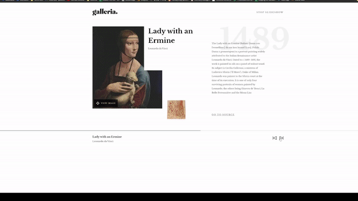

# Galleria

  

## ⚙️ Features

- Play the slide show, checking the flow with progress bar on the downside.
- View a large image of a painting with a modal.
- Responsive design for mobile, table, and PC.

## 📌 Lessons from the project

- Different usage of Flex and Grid in CSS.
- Building own hooks in React.
- Using Portals in React to create Modals.
- Using Framer Motion for animation effects.
- Deploying the project with Netlify

## 👩🏻‍🔧 Future Improvement

- Improve the image loading speed in the slide page.
- Change css media query code into scss.
- Edit some styles on the slide page for a large screen (width > 1300px). Lower the progress bar Y position.   

## 💻 Technologies

- HTML
- CSS
- Sass
- React
- Netlify

## 🔨 Set up

- Download and install Git
- `> git clone https://github.com/chepark/galleria.git`
- `> cd galleria`
- `> npm install`
- `> npm start`

## 🔗 Link

https://soft-pothos-04baa8.netlify.app
